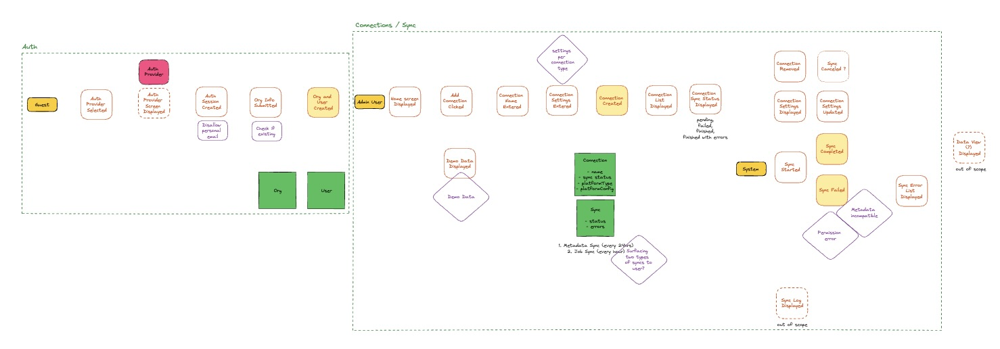

In my [previous article on Domain Driven Design](/post/domain-driven-design), I defined DDD as a methodology for building a shared understanding among your team.
I framed it as a way to map your business into subdomains and create a ubiquitous language that everyone—from product managers to engineers—can use.

But that's the goal, not the process. How do you get a room full of PMs, designers, and engineers to actually build that shared model?
How do you find the boundaries for your Bounded Contexts?

EventStorming is the practical answer.
It’s the high-collaboration workshop that turns the abstract theory of DDD into a concrete, shared artifact.
It's the "how" that makes the "why" of DDD possible.

<figcaption>An example of a simple EventStorming workshop output.</figcaption>

## What is EventStorming?

Despite its "product-y" looking spelling, EventStorming is just a low-tech, high-impact group activity
designed to uncover and share domain knowledge. Think sticky notes, whiteboards, and lots of collaboration.

Ideally you do this in person. But if your team is remote, tools like Excalidraw or Miro can work as well.

I like to kick off an EventStorming session as soon as we've identified the subdomain we are tackling and have a general sense of its main features.

Who leads the session depends on the goal. If the goal is high-level process discovery (exploring the "what"), a PM or designer might be the best fit.
The output is a shared map of the business process. If the goal is having a blueprint for implementation (mapping the "how" and "where"), an engineer or tech lead is a better fit.

Either way, the entire cross-functional team must be in the room. This is non-negotiable.

The goal is twofold:

1. a visual representation of the domain model which can be used for the next steps.
2. (more importantly) a shared understanding of the domain across the team.

Here are the elements you can add to the board. You can go through them in this order, or jump around and iterate as needed.

**Phase 1: big picture (the "what")**

1. **Unstructured Exploration:** brainstorm domain events (in past tense). Orange sticky notes
2. **Timelines:** sequence events; starting with the “happy path”, then add alternative scenarios.
3. **Pivotal Events:** highlight major business events indicating a change in context or phase.

**Phase 2: process modeling (the "how")**

4. **Commands:** actions that trigger events or flows. Blue sticky notes
5. **Actors:** the human roles who cause things to happen. Small yellow sticky notes.
6. **Policies:** automated commands triggered by specific events. Purple sticky notes
7. **Read Models:** data views that actors use to decide on commands. Green sticky notes.
8. **External Systems:** dependencies outside your domain. Pink sticky notes.
9. **Pain Points:** bottlenecks, manual steps that require automation, or missing domain knowledge. Rotated red sticky notes.

**Phase 3: software design (the "where")**

10. **Aggregates:** clusters of domain objects with consistent state. Draw large boxes with marker.
11. **Bounded Contexts:** map out where specific language and models apply. The largest boxes.

You can take breaks or stop at any point, but the more detail you discover, the better.

## Excalidraw Template

This process is about moving from abstract theory to a concrete artifact.
To accelerate that, I've created an Excalidraw template with all the artifacts (orange events, blue commands, etc.) and phases laid out.

Grab it, fork it, and use it to run your next session.

🎨 **[Excalidraw](https://excalidraw.com/#json=rUgFT5GLZdFv2sVyKtApJ,VkUUCciXroPA5CQSPOh9qw)**

## Further Reading

- Khononov, Vlad. [Learning Domain-Driven Design](https://www.oreilly.com/library/view/learning-domain-driven-design/9781098100124/). O'Reilly, 2021.
