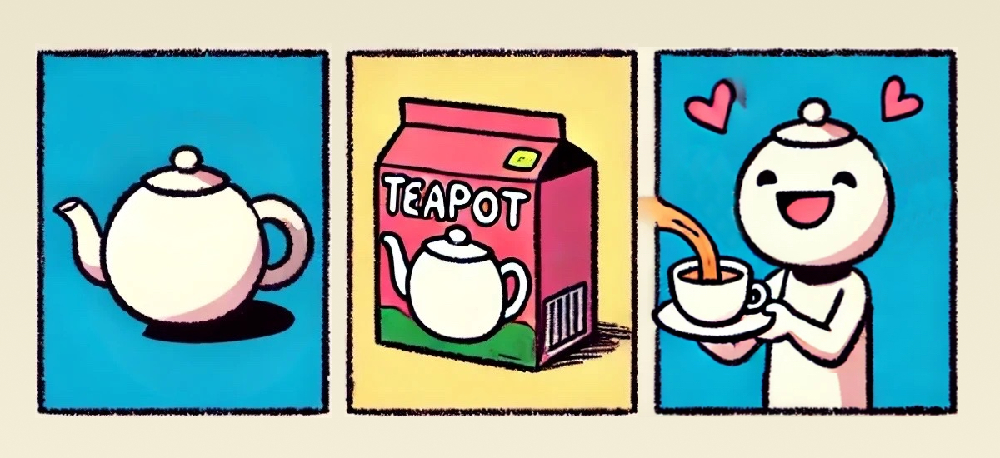

<figcaption>
  A classic example of an everyday product designed with form, function, and
  user experience in mind.
</figcaption>

Given that one of this blog’s main goals is to encourage engineers to become more product-minded, we should start off with a clear definition of what a product even is.

A [classic business definition](https://personalmba.com/product/) of a product is simply: _a self-contained unit of economic value_.

But here's my take as someone mostly involved with _building_ products:

**A product is a packaged set of features that enable users to achieve specific goals while delivering meaningful experiences.**

The packaging—your brand, marketing, and sales strategy—elevates it from just a tool into something that people want and are willing to pay money for.
The customer journey starts way before interacting directly with the product and continues long after:
Awareness, acquisition, support, etc., all should be considered when making products.
Tony Fadell emphasizes the importance of this in his 2022 book _Build: An Unorthodox Guide to Making Things Worth Making_,
which has greatly influenced my approach to product engineering.

But for now, let’s focus on the product’s core: its features designed to address your target users’ specific needs and tasks.

Great products serve two major aspects: they provide _utility_, and they provide an _experience_.
Consider the pair as orthogonal axes.
A product with high utility but low experience is just a "Tool"—it works, but it's painful.
A product with high experience but low utility is a "Toy."

```
         ↑
         |                   |
   High  |      "Tool"       |    "Product"
         | (High Utility,    | (High Utility,
         |   Low Experience) |  High Experience)
         |                   |
Utility  +-------------------+-------------------
         |                   |
         |      "Dud"        |     "Toy"
    Low  |  (Low Utility,    | (Low Utility,
         |   Low Experience) |  High Experience)
         |                   |
         +-------------------+------------------->
                  Low               High
                        Experience
```

Great real-world "Products" land in the high-utility, high-experience quadrant.
The following lists explore how to think about building for both axes.

## The Utility Axis: Solving Problems

Meaningful products typically achieve one of three outcomes about solving a problem, or maybe more generally
“improving a thing” (a problem, workflow, process, task, etc.).
Think about which category the product you are building fits into to better define its purpose and strategy.

1. **Make It Possible for More People to Do the Thing** (Democratization)

   Example: Before word processors, only trained typists could produce professional documents.
   Now everyone from children to grandparents can easily write and format.

2. **Increase the Power of Work** (Augmentation)

   Example: A crane allows a construction worker to lift heavy materials that would be impossible to move manually.
   Similarly, software like Photoshop enables artists to create complex digital art that would be challenging with traditional mediums.

3. **Get Rid of the Entire Need for the Thing** (Consolidation)

   Example: Central heating systems have eliminated the need for wood-burning stoves in each room.
   Similarly, smartphones have replaced many devices like cameras, GPS units, and even flashlights, consolidating them into one handy gadget.

## The Experience Axis: Delivering Satisfaction

Beyond just solving problems, great products are built to provide an experience.
This encompasses how users interact with the product, the emotional response it evokes, and the overall satisfaction it delivers.

1. **Turning Tasks into Joy: Delightful Interactions**

   A product that is enjoyable to use can turn mundane tasks into pleasant experiences.
   Think of how a sleek smartphone not only makes calls but also provides a satisfying tactile and visual experience.

2. **Empowering Users: Feeling Capable and In Control**

   Good products make users feel capable and in control.
   For example, a well-designed photo editing app can make anyone feel like a professional photographer.

3. **Forming Bonds: Emotional Connections with Products**

   Some products create strong emotional bonds with users.
   Whether it’s a favorite pair of headphones that deliver crisp sound during your morning jog or a journal app that keeps your thoughts organized,
   these products become integral parts of daily life. They don’t just perform functions; they resonate on a personal level.

4. **Aspirations and Identity: The Brand Experience**

   Products often carry the essence of a brand’s identity, contributing to the overall experience.
   Unboxing a new pair of Nike sneakers can make you feel like an athlete even before you hit the track.
   Branded products serve aspirations, tapping into users’ dreams and ambitions.
   The anticipation, the packaging, and the first interaction all add layers to the user’s experience,
   making them feel connected to something bigger than just the product itself.

## I’m an Engineer, Not a Designer. Why Should I Care?

You might be thinking, “Why should I care about all this? Engineers just need to solve problems. If the solution works, users will come.”

But users have choices. They can choose from a variety of products that solve the same problem.
They can also choose to not care about the problem at all. Users care about the experience at least as much as the solution.

If you focus on only solving problems, you build 'Tools,' not products.
You trap yourself in that 'high-utility, low-experience' quadrant, which is just waiting to be disrupted by someone who builds for both axes.

“Just hire a skilled head of marketing later?” That won’t be enough.
Experience is a foundational aspect of your product that your team as a whole needs to get right.

Let's strive to build products that do both from the start.

## Recommended Reading

- Fadell, Tony. (2022). _Chapter 3: Build Your Product_ in Build: An Unorthodox Guide to Making Things Worth Making. Harper Business.
- Norman, Don. (2013). The Design of Everyday Things: Revised and Expanded Edition. Basic Books.
